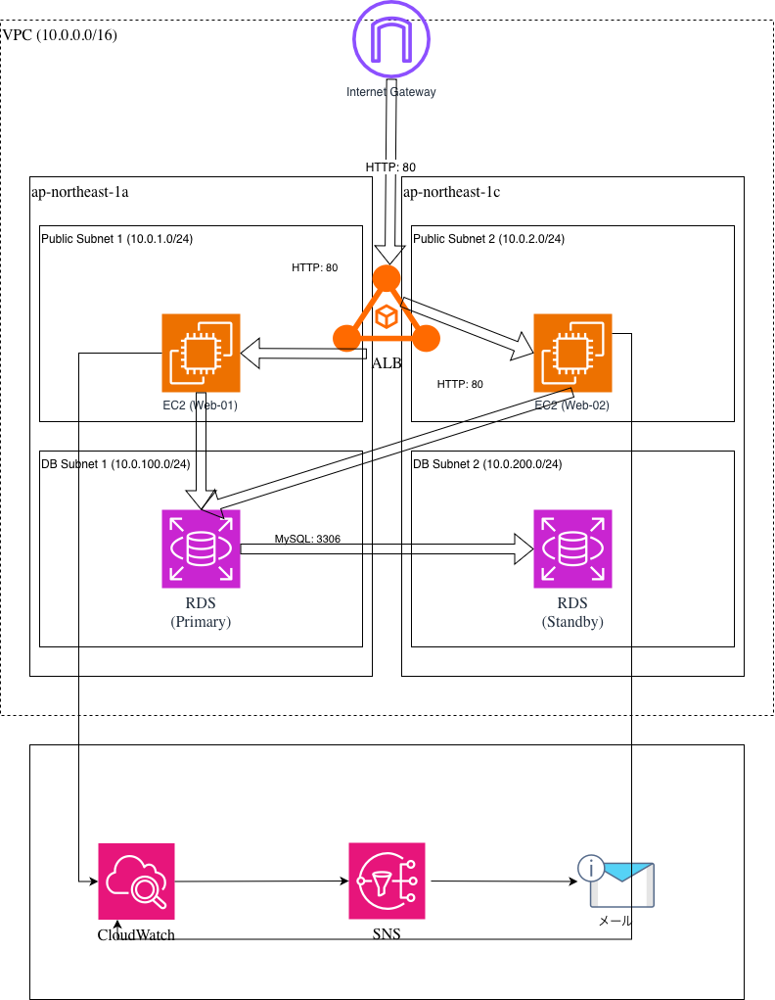

# AWS 高可用性3層アーキテクチャ（Terraform）

## 概要
AWS上に、可用性とセキュリティを考慮したWebアプリケーションのインフラ基盤をTerraformで構築したプロジェクトです。
物理ネットワーク構築・運用の実務経験で培った「セキュアなトラフィック制御」や「障害に強いネットワーク設計」の知見を、クラウド（AWS）上のインフラ構成（IaC）として落とし込んでいます。

## アーキテクチャ構成図


## 使用技術
- **Cloud Provider**: AWS (Amazon Web Services)
- **IaC**: Terraform (v1.5.0以上)
- **主要AWSリソース**: VPC, ALB, EC2(Amazon Linux 2023), RDS(MySQL 8.0)

## 💡 設計のこだわり・アピールポイント

### 1. 物理NWの知見を活かした「最小権限の原則」に基づくトラフィック制御
セキュリティグループをバケツリレーのように連携させ、強固なアクセス制御を実現しています。
- **ALB**: インターネットからのHTTP(80)通信のみを許可
- **EC2**: ALBのセキュリティグループからのアクセスのみを許可
- **RDS**: EC2のセキュリティグループからのMySQL(3306)通信のみを許可

### 2. Multi-AZによる高可用性の確保
単一障害点（SPOF）を排除するため、Webサーバー（EC2）およびデータベース（RDS）を異なる2つのアベイラビリティゾーン（`ap-northeast-1a`, `ap-northeast-1c`）に分散配置し、ALBによる負荷分散とRDSのMulti-AZ構成を実装しています。

### 3. コスト最適化（FinOps）とセキュリティを両立した柔軟な設計
本来のベストプラクティス（厳密な3層アーキテクチャ）ではEC2をプライベートサブネットに配置しますが、個人学習環境におけるNAT Gatewayの維持コストを考慮し、本環境ではあえてEC2をパブリックサブネットに配置するコスト最適化の判断を行っています。

その代替の防衛策として、EC2のインバウンドルールを「ALBからの通信」のみに限定し、インターネットからの直接アクセスを論理的に完全に遮断しています。
また、実務でのエンタープライズ要件に即座に対応できるよう、あらかじめ `private_1` `private_2` のサブネット（`10.0.10.0/24`, `10.0.20.0/24`）も定義しており、コスト意識と将来の拡張性を担保した設計としています。

### 4. IaCのベストプラクティスと機密情報の保護
- リソースごとに `.tf` ファイルを分割（`vpc.tf`, `ec2.tf`, `rds.tf` など）し、可読性と保守性を高めています。
- パスワード等の機密情報が含まれる `*.tfstate` や `*.tfvars` は `.gitignore` で厳格に除外し、ダミーファイル（`terraform.tfvars.example`）を用意することで、チーム開発を想定した安全なコード管理を徹底しています。
- `.terraform.lock.hcl` をバージョン管理に含め、プロバイダーバージョンの差異によるエラーを未然に防ぐ運用としています。

## ディレクトリ構成
```text
.
├── .gitignore                   # 機密情報・キャッシュの除外設定
├── .terraform.lock.hcl          # プロバイダーのバージョン固定
├── alb.tf                       # ALBおよびターゲットグループの定義
├── ec2.tf                       # EC2インスタンスとApacheの自動セットアップ
├── outputs.tf                   # ALBのDNS名、RDSエンドポイントの出力
├── portfolio-architecture.png   # アーキテクチャ構成図
├── providers.tf                 # AWSプロバイダーと共通タグの設定
├── rds.tf                       # RDS（Multi-AZ）とサブネットグループの定義
├── terraform.tfvars.example     # tfvarsのサンプル（機密情報を除く）
├── variables.tf                 # CIDRやパスワードなどの変数定義
└── vpc.tf                       # VPC、サブネット、ルートテーブルの定義
